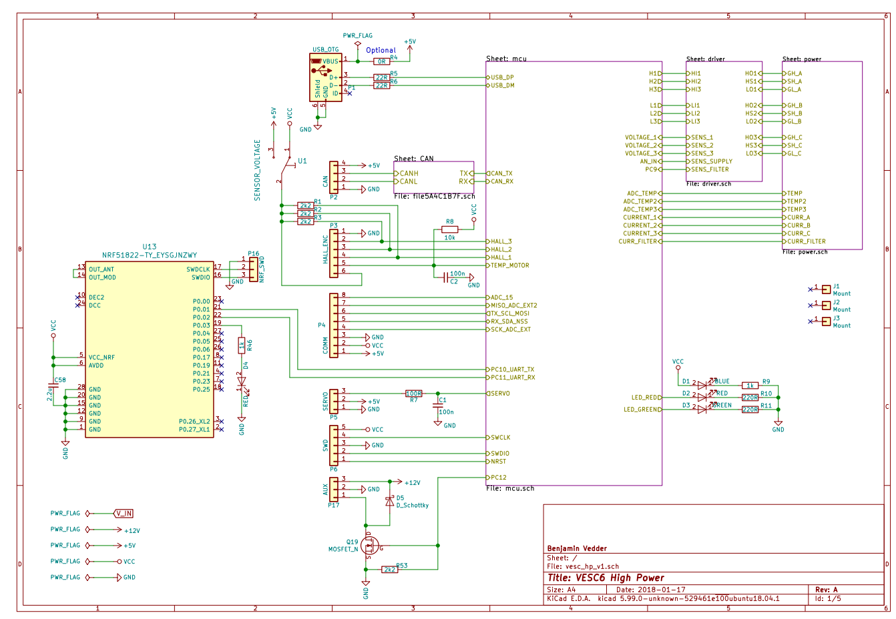

## Members
Colton Tshudy, EE CRA '24, coltont@vt.edu 

## Repo Link
<a class="button is-link" href="https://github.com/ColtonTshudy/coltont-vesc" >https://github.com/ColtonTshudy/coltont-vesc</a>

## Photo
Image courtesy of <a href="https://vesc-project.com/">VESC</a> open-source project under the MIT open-source license. Original schematic by Benjamin Vedder.

## Mentor
Pending

## Current Status
Design in progress

## Project Overview

This project aims to design, produce, and program an electronic speed controller (ESC) based on the VESC open-source project. This will involve circuit schematic design, PCB layout, soldering, and firmware flashing. The controller will be based on an STM32F407 or STM32F405 microcontroller and feature FOC based brushless motor control. 
Alongside this, I am also devloping a head unit that communicates over CAN to display system vitals based on a Raspberry PI adjacent single board computer (AML-S905X-CC). Progress can be tracked <a href="https://github.com/ColtonTshudy/vesc-dash-3">here</a>. An older version can also be found <a href="https://github.com/ColtonTshudy/vesc-dash">here</a>.

Tools:
- KiCAD
- Qt Creator IDE
- Electronic test equipment (oscope, multimeter, power supply)
- Test environment (electric motor and stand)

## Educational Value Added

This project is intended to improve my ability to understand and design circuits, work with ARM-based microcontrollers, and understand the theory behind controlling 3 phase brushless motors. As a Senior engineering student majoring in CRE (Controls, Robotics, and Autonomy), this project will be beneficial in aiding my education by learning the operating principles of brushless motors. These types of motors are currently used in all types of robotics, where accuracy, speed, and/or efficiency are required. Furthermore, we will be working with ARM-based microprocessors which have been increasingly seeing use in embedded sytems.

## Tasks

Prototyping:
Schematic: Referencing the offical VESC schematic as well as other VESC based projects, design a suitible test board to interface with a STM32F07 dev board
- Consists of mosfet driver and power stage design. Control board is handled mostly by the development board.
Layout: Design the PCB layout (may have to meet with colleagues or professors or other online research)
Acquisition: Purchase parts required for the test setup (STM32F407 dev board, pcb described above)
Order PCB: JLCPCB or similar (no solder stencil required here?)
Assembly: Assemble/solder the test setup
Programming: Modify the VESC firmware to work with the test setup
Verification: Use VESC tool (computer software) to interface with the test setup, test sensors for correct readings through this software
Testing: Connect a small motor and tweak settings
Hardware revision (if necessary): Revise test setup hardware to resolved issues found in steps above

Real Deal:
Schematic: Use lessons learned from the above project to design an all-in-one PCB with onboard STM32F405
Layout: Design the PCB layout
Order PCB: JLCPCB or similar, with solder stencil
Aquisition: Purchase parts required
Assembly: Assemble/solder PCB 
Programming: Flash firmware developed above
Verification: Connect VESC tool to verify connectivity and test sensors
Testing: Connect a small motor and tweak settings
Hardware revision (if necessary): Revise PCB design and repeat above steps

## Design Decisions

#Brushless Motor Control Methodology
Controlling the speed of a brushless DC motor requires modulating the voltage at the three phases of the motor, referred to as U, V, W. There are generally two methodologies for controlling brushless DC motors: pulse width modulation (PWM) and field oriented control (FOC).
Based on preliminary research, field oriented control (FOC) provides more low-end torque but lower top speeds. PWM control provides higher top speed but lower torque. Utilizing the VESC firmware, we will be able to swap between these two modes, provided we use the VESC 6 hardware standard.

## Design Misc

<!-- Your Text Here. See Example above -->
TODO

## Steps for Documenting Your Design Process

<!-- Your Text Here. See Example above -->
TODO

## BOM + Component Cost

<!-- Your Text Here. See Example above -->
Coming soon!

## Timeline

<!-- Your Text Here. See Example above -->
TODO

## Useful Links
VESC
- Firmware: https://github.com/vedderb/bldc
- Schematics: https://vesc-project.com/node/311
- CAN Frames: https://github.com/codermonkey42/VESC_CAN

Colton Tshudy
- https://github.com/ColtonTshudy/vesc-dash
- https://github.com/ColtonTshudy/vesc-dash-3
- https://github.com/ColtonTshudy/vesc-can-websocket

VESC Development Discord
- https://vesc-project.com/node/3284

## Log

<!-- Your Text Here. See Example above -->
<table>
  <tr>
    <td>Date</td>
    <td>Notes</td>
  </tr>
  <tr>
    <td>8/8/2023</td>
    <td>Created git repo for this project and configured README.md</td>
  </tr>
</table>